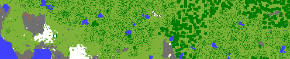

# Minecraft Map Generator

This program loads Minecraft save data in the [Anvil file format](https://minecraft.wiki/w/Anvil_file_format) and generates a png file looking like an [ingame Map](https://minecraft.wiki/w/Map). The color of each block was extracted from the game using the procedure described in [Instructions.md](color_table/Instructions.md).

## World Regions
A Minecraft world is made of 512x512 block regions. Each region is stored in a separate file. These files are named `r.X.Y.mca` where X and Y are indices of the region itself. Each region consists of 1024 chunks sized 16x16 blocks and stretching from 0 to the world height limit. A chunk can be further subdivided into 16x16x16 block sub chunks.

## Image Generation
The namespaced IDs of the topmost (visible) blocks has to be determined. This is done by iterating over all blocks in the desired area. These namespaced IDs are mapped into RGB values.

## Limitations
The map shown at the top of this document looks entirely flat. This is because maps in Minecraft use shading where colors are slightly adjusted to make slopes visible.

## License
Copyright 2021 Daniel Gekeler

Licensed under the Apache License, Version 2.0 (the "License");
you may not use this file except in compliance with the License.
You may obtain a copy of the License at

    http://www.apache.org/licenses/LICENSE-2.0

Unless required by applicable law or agreed to in writing, software
distributed under the License is distributed on an "AS IS" BASIS,
WITHOUT WARRANTIES OR CONDITIONS OF ANY KIND, either express or implied.
See the License for the specific language governing permissions and
limitations under the License.
